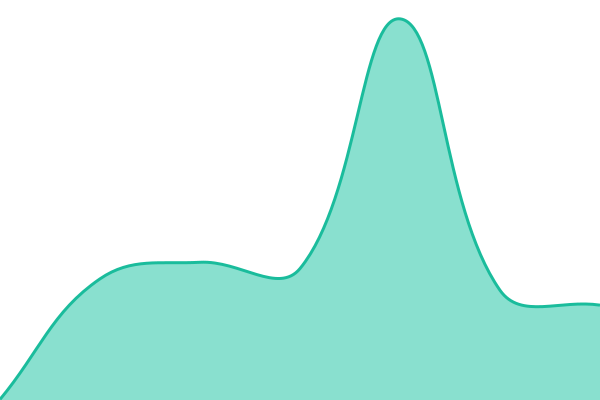
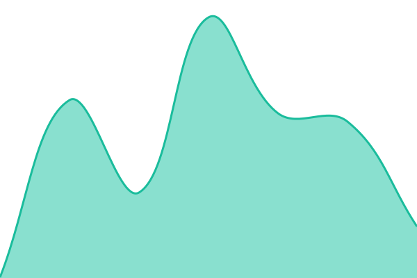
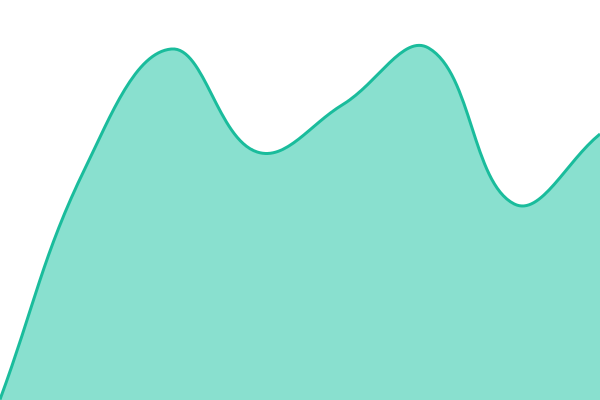

# [📈 Live Status](https://kooolkat357.github.io/nordicpulse-status): <!--live status--> **🟩 All systems operational**

This repository contains the open-source uptime monitor and status page for [kooolkat357](https://kooolkat357.github.io/nordicpulse-status), powered by [Upptime](https://github.com/upptime/upptime).

With [Upptime](https://upptime.js.org), you can get your own unlimited and free uptime monitor and status page, powered entirely by a GitHub repository. We use [Issues](https://github.com/kooolkat357/nordicpulse-status/issues) as incident reports, [Actions](https://github.com/kooolkat357/nordicpulse-status/actions) as uptime monitors, and [Pages](https://kooolkat357.github.io/nordicpulse-status) for the status page.

<!--start: status pages-->
<!-- This summary is generated by Upptime (https://github.com/upptime/upptime) -->
<!-- Do not edit this manually, your changes will be overwritten -->
<!-- prettier-ignore -->
| URL | Status | History | Response Time | Uptime |
| --- | ------ | ------- | ------------- | ------ |
|  [Website](https://nordicpulse.ai) | 🟩 Up | [website.yml](https://github.com/kooolkat357/nordicpulse-status/commits/HEAD/history/website.yml) | 

 356ms
     
 | 

<a href="https://kooolkat357.github.io/nordicpulse-status/history/website">100.00%</a>
    

|  [App](https://nordicpulse.ai/app) | 🟩 Up | [app.yml](https://github.com/kooolkat357/nordicpulse-status/commits/HEAD/history/app.yml) | 

 193ms
     
 | 

<a href="https://kooolkat357.github.io/nordicpulse-status/history/app">100.00%</a>
    

|  [API Gateway](https://nordicpulse-api.fly.dev/api/health) | 🟩 Up | [api-gateway.yml](https://github.com/kooolkat357/nordicpulse-status/commits/HEAD/history/api-gateway.yml) | 

 1952ms
     
 | 

<a href="https://kooolkat357.github.io/nordicpulse-status/history/api-gateway">100.00%</a>
    

|  [Database & Auth](https://vudyxilzwpquznhdpiuh.supabase.co/auth/v1/health) | 🟩 Up | [database-and-auth.yml](https://github.com/kooolkat357/nordicpulse-status/commits/HEAD/history/database-and-auth.yml) | 

 557ms
     
 | 

<a href="https://kooolkat357.github.io/nordicpulse-status/history/database-and-auth">100.00%</a>
    

<!--end: status pages-->

[**Visit our status website →**](https://kooolkat357.github.io/nordicpulse-status)

## 📄 License

- Powered by: [Upptime](https://github.com/upptime/upptime)
- Code: [MIT](./LICENSE) © [Anand Chowdhary](https://anandchowdhary.com)
- Data in the `./history` directory: [Open Database License](https://opendatacommons.org/licenses/odbl/1-0/)
